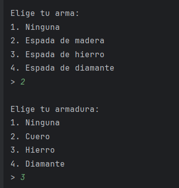
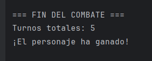
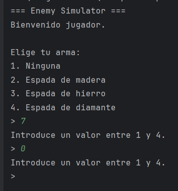

# EnemySimulator

He hecho una simulación de un combate donde pelea el personaje principal(tu) y un mob hostil: un zombie o un enderman

# App

Tiene varias características como la vida que tiene el personaje principal, si lleva armadura, si lleva armas y de que tipo
pudiendo ser el arma siendo ninguna, de madera, hierro, diamante.
La armadura siendo: no teniendo ninguna, de cuero, hierro y diamante.
Aparte de eso te muestra cuantos turnos han pasado y si has ganado tu o los mounstros,
tambien puedes ver si haz escogido un valor inválido siendo un entre un valor menor de uno y mayor de cuatro.

aquí lo puede ver de una forma más gráfica:
Para ver la categoría de arma y armadura:

Para ver quien ha ganado y cuantos turnos han llevado:

para ver el error de valor:

# mobs

He creado los tres mobs: Enderman, Zombie y oveja con la vida que tienen y el daño que hacen
Tambien poniendo en la forma como interactúan con el personaje, por ejemplo siendo que el zombie se mueve hacia el personaje, o que la obeja se queda en el pasto sin molestarte, etc

# character

En character puse al personaje principal(MainCharacter) con la vida que tiene, su fuerza y su defensa

# abstrac

como les afecta el daño y creandole los atributos de fuerza y vida
